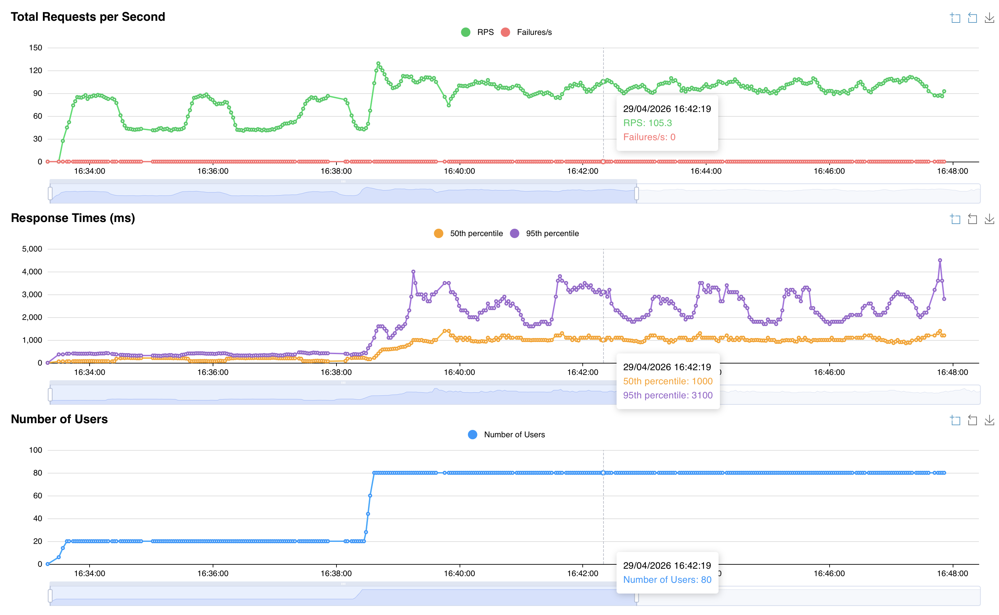

# Load tests

**WARNING**: This is **99%** vibe coded and should be treated as a playground for now.



Load testing scenarios for the Accounts service.

Available scenario: **OIDC full E2E** — covers the complete login flow from the first
`/o/authorize/` request down to the token exchange.

---

## Flow under test

```
GET /api/v1.0/o/authorize/
  └─ GET /api/v1.0/login/
       └─ GET /api/v1.0/oidc/authenticate/
            └─ GET upstream /authorize (IdP)
                 └─ GET /api/v1.0/oidc/callback/
                      └─ GET <redirect_uri>?code=…
                           └─ POST /api/v1.0/o/token/
```

Two virtual user classes are simulated:
- `OIDCNewSessionUser` — cold login, full OIDC authentication round-trip
- `OIDCExistingSessionUser` — active session, skips the IdP and goes straight to token exchange

---

## Setup

### 1) Start the backend

```bash
make run-backend
```

### 2) Start the local mock IdP (required for fully automated E2E)

```bash
uv run python src/loadtests/oidc/mock_idp/run.py
```

Quick smoke test for the mock IdP:

```bash
uv run python src/loadtests/oidc/mock_idp/smoke_test.py
```

### 3) Point the backend at the mock IdP

Add the following variables to the backend environment (`env.d/development/common.local` or equivalent):

```bash
OIDC_OP_AUTHORIZATION_ENDPOINT=http://localhost:9908/authorize
OIDC_OP_TOKEN_ENDPOINT=http://host.docker.internal:9908/token
OIDC_OP_USER_ENDPOINT=http://host.docker.internal:9908/userinfo
OIDC_OP_JWKS_ENDPOINT=http://host.docker.internal:9908/jwks
OIDC_RP_CLIENT_ID=accounts-rp
OIDC_RP_CLIENT_SECRET=accounts-rp-secret
OIDC_RP_SIGN_ALGO=RS256
```

Then restart the backend (`make run-backend`).

### 4) Run the environment preflight check

```bash
make oidc-loadtest-preflight
```

Fails immediately with a clear message if the backend is unreachable or if the upstream
IdP returns an interactive login page (`200`) instead of redirecting to the callback (`302`).

### 5) Create the OAuth test client

```bash
make oidc-loadtest-setup
```

> All `make oidc-loadtest-*` targets run steps 4 and 5 automatically before spawning Locust.

---

## Running with the Locust UI

```bash
make oidc-loadtest-ui
```

Opens the UI at `http://localhost:8089`.

To drive the UI session with the `mix-realistic` load shape:

```bash
OIDC_LOADTEST_PROFILE=mix-realistic make oidc-loadtest-ui
```

> In the Locust UI, enable **Use Load Shape** so that the user count and spawn rate are
> controlled by the profile defined in `profiles.py`.

---

## Running headless (built-in profiles)

| Profile | Command | Users | Duration |
|---|---|---|---|
| smoke | `make oidc-loadtest-smoke` | 5 | 2 min |
| nominal | `make oidc-loadtest-nominal` | 50 | 10 min |
| mix-realistic | `make oidc-loadtest-mix-realistic` | 20 → 80 | ~20 min |

All available profiles: `smoke`, `nominal`, `peak`, `endurance`, `mix-realistic`.

Run a custom profile:

```bash
cd /Users/dinum-327808/dev/accounts
make oidc-loadtest-profile OIDC_LOADTEST_PROFILE=peak
```

---

## Realistic session mix

The ratio between cold and warm users is configurable:

```bash
OIDC_LOADTEST_EXISTING_SESSION_USER_WEIGHT=70   # default
OIDC_LOADTEST_NEW_SESSION_USER_WEIGHT=30        # default
```

---

## SLO validation after a headless run

```bash
make oidc-slo-check OIDC_LOADTEST_PROFILE=mix-realistic
```

Including per-flow FLOW rows:

```bash
make oidc-slo-check-flows OIDC_LOADTEST_PROFILE=mix-realistic
```

Custom thresholds:

```bash
make oidc-slo-check-flows \
  OIDC_LOADTEST_PROFILE=mix-realistic \
  OIDC_SLO_MAX_FAILURE_PCT=0.5 \
  OIDC_SLO_MAX_P95_MS=1200 \
  OIDC_SLO_MAX_P99_MS=2000
```

Make defaults: `failure < 1%`, `p95 < 1500 ms`, `p99 < 2500 ms`.

---

## Environment variables

| Variable | Default | Description |
|---|---|---|
| `OIDC_LOADTEST_PROFILE` | `mix-realistic` | Load profile name |
| `OIDC_LOADTEST_HOST` | `http://localhost:9901` | Backend base URL |
| `OIDC_LOADTEST_CLIENT_ID` | `oidc-test-client` | OAuth client ID |
| `OIDC_LOADTEST_CLIENT_SECRET` | `oidc-test-secret` | OAuth client secret |
| `OIDC_LOADTEST_REDIRECT_URI` | `https://client.example.test/callback` | OAuth redirect URI |
| `OIDC_LOADTEST_SCOPE` | `openid email` | OAuth scopes |
| `OIDC_LOADTEST_EXISTING_SESSION_USER_WEIGHT` | `70` | Weight for warm-session users |
| `OIDC_LOADTEST_NEW_SESSION_USER_WEIGHT` | `30` | Weight for cold-login users |
| `OIDC_LOADTEST_MAX_REDIRECT_HOPS` | `8` | Maximum redirect hops followed |
| `OIDC_LOADTEST_PRECHECK_TIMEOUT` | `5` | Preflight HTTP timeout (seconds) |
| `OIDC_LOADTEST_RESULTS_DIR` | `src/loadtests/oidc/results` | CSV output directory |
| `OIDC_SLO_MAX_FAILURE_PCT` | `1.0` | SLO: max failure rate (%) |
| `OIDC_SLO_MAX_P95_MS` | `1500` | SLO: max p95 response time (ms) |
| `OIDC_SLO_MAX_P99_MS` | `2500` | SLO: max p99 response time (ms) |

---

## Code structure

```
src/loadtests/oidc/
├─ locustfile.py          Locust user classes
├─ scenarios.py           Full E2E flow logic
├─ profiles.py            Load profiles (LoadShape)
├─ config.py              Environment-based configuration
├─ preflight.py           Pre-run environment check
├─ check_slo_from_csv.py  SLO validation from Locust CSV output
└─ mock_idp/
   ├─ server.py           Local RS256-signed IdP (JWKS + authorize/token/userinfo)
   ├─ run.py              Standalone runner
   └─ smoke_test.py       In-process validation harness
```


